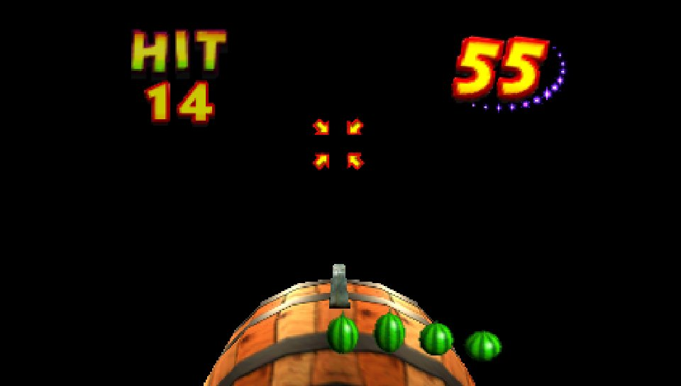
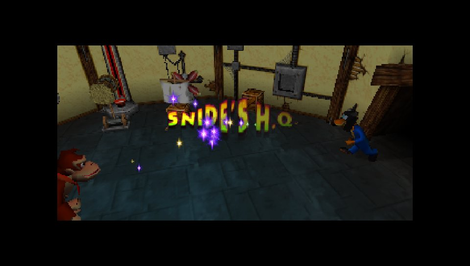

# Native Klamour practice validation

All four Krazy Kong Klamour difficulties reach their win state and return to
Snide's HQ in the ARM game running in Linux Vita3K/Vulkan. The test controls the
game through its input callback; it does not edit the score, targets, timer,
collision state or minigame logic.

## Final runs, September 6, 2026

| Difficulty | Map | Initial target requirement | Round timer | Observed reloads | Result |
| --- | ---: | ---: | ---: | ---: | --- |
| Easy | 101 | 10 | 129 | 2 | Count reaches zero; win; return to Snide HQ |
| Normal | 141 | 15 | 129 | 3 | Count reaches zero; win; return to Snide HQ |
| Hard | 142 | 5 | 81 | 1 | Count reaches zero; win; return to Snide HQ |
| Insane | 143 | 10 | 81 | 2 | Count reaches zero; win; return to Snide HQ |

Every run records the initial timer of 162. Across the four final runs, the game
registers 40 target decrements, eight reloads and no penalty increments. Logs show
both displayed and target counts at zero, controller state 2 (the success branch),
then return to map 15 with game mode 6 after the win. The observer does not advance
those states itself.

The Normal screenshot shows the counter reduced to 14 during the dark interval
following a hit:

Vita3K's native screenshot also captures the return from Insane to Snide's HQ:

## Correct entry and input

The probe requests the minigame after Adventure becomes playable in Training
Grounds or DK's house. It uses `func_global_asm_80712774`, the same entry called
by Snide's bonus menu in `src/menu/code_0.c`. That calls the original transition
and then sets game mode 13. The original `805FF8F8`/`805FF898` return path can then
return to Snide's HQ without a saved bonus-barrel exit record. Earlier raw
Adventure-mode warps could reach the win state but remain in the ending cutscene;
that test setup did not establish the required return context. No game exit
routine was patched to make these runs return.

The test reads Klamour controller actor 125 and its existing target layout. The
original target actor code at `8002A010` uses child index 5 for the banana and
selects coordinate slot `(gameinfo->unk8[5] & 0x7f) + 1`. The probe translates that
slot into stick directions. The original `80027548` firing handler consumes
ammunition while aiming, and reloads when the stick is centered and A is pressed.
The input driver follows those rules, waits for the target to appear, and issues
one shot per appearance so extra projectiles do not arrive after a reshuffle.

A single atomic packet carries the button and axis values from the main-loop
observer to the controller callback. The callback uses the general probe controls
during intro/result screens. This exercises actual game aiming, firing, projectile
collisions, counter updates and success/return code; it does not test physical
controller delivery or human difficulty.

## Emulator and build inputs

- Vita3K v0.2.1 `4074-496939b6`, official Linux ARM64 CI artifact, full revision
  `496939b602703951277263c7b3e60a9ae36879c1`.
- Vulkan with Mesa 25.2.8 llvmpipe (LLVM 20.1.2, 128 bits).
- `memory-mapping: double-buffer`, `disable-surface-sync: false`, resolution 1x.
- `cpu-opt: true`, Vita3K's default. The inherited diagnostic profile had disabled
  it. Source at this revision selects all safe Dynarmic optimizations and fast
  memory access when enabled. The same Hard VPK failed its gameplay deadline with
  this option disabled and cleared the minigame with it enabled. This is a test
  environment correction, not a change to the port's physics or timing, and does
  not measure physical Vita performance.
- vitaGL `cd3791e29ff7f1c0ab349f12c7231f4871ce6a75`, vitaShaRK
  `df24065e65098b2d1ac533760109ad4367573f28`, `NO_SPLASHSCREEN=1`, shader cache and
  depth/stencil storage enabled. Both vitaGL and RT64 readback speedhacks are off.
- Release ARM build with diagnostics and scripted input on, scripted pause off,
  function profiling and renderer tracing off. `DK64_VITA_PROBE_MAP` selects the
  map in the table above. The title is the separate `DK64RT001` probe.
- Each run starts from the same copied probe saves. The original saves and the
  existing quiet hardware VPK remain unchanged. Audio uses a dummy host device;
  these runs do not establish audible quality.

The CPU defaults and implementation can be checked in the matching Vita3K
[`config.h`](https://github.com/Vita3K/Vita3K/blob/496939b602703951277263c7b3e60a9ae36879c1/vita3k/config/include/config/config.h#L177)
and
[`dynarmic_cpu.cpp`](https://github.com/Vita3K/Vita3K/blob/496939b602703951277263c7b3e60a9ae36879c1/vita3k/cpu/src/dynarmic_cpu.cpp#L336).

## Evidence and limits

Local evidence is under `build/vita3k-linux-control/klamour-<map>-default-cpu/result/`.
Each directory retains the VPK, input/configuration hashes, logs and a
`validation.json` checking initialization, round duration, count reductions,
reloads, win state and the subsequent return map. Normal, Hard and Insane also
have native screenshots; Easy's final run has log evidence, while its earlier
rendering screenshot is retained in the main Vita report. Runs are bounded or
stopped after the verified return; they do not test graceful application shutdown.
ROM, firmware and shader-compiler files are excluded from Git.

The input regression covers readiness gates, Snide versus ordinary map entry,
private caller stack and FPR aliases, read-only state observation, all six aiming
slots, firing/release, a fresh round, cooldown, reload and fallback behavior.
With the option disabled, the main executable's preprocessed source is unchanged;
the map-probe implementation and its generated timing hook compile out. CMake
continues to reject enabling map probes in the regular title or without diagnostics.

These results establish practice-mode completion in this emulator profile. Normal
bonus-barrel access, the menu's unlock/selection flow, physical Vita controls,
hardware rendering/performance, audible audio quality and broader gameplay remain
separate validation requirements. The known framebuffer first-read limitation is
not resolved by these minigame runs.
