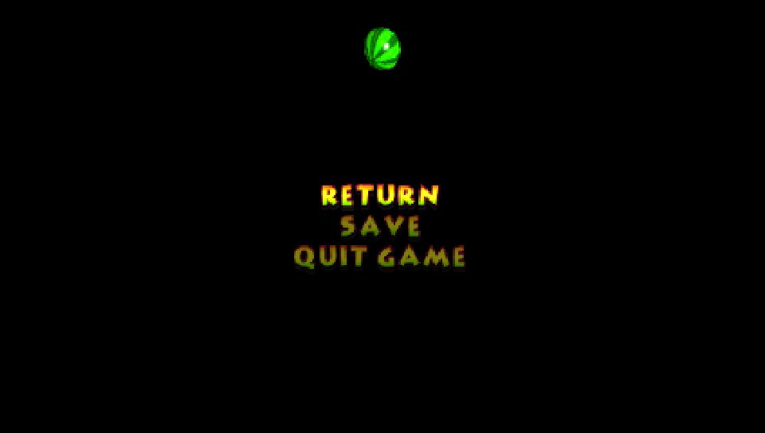
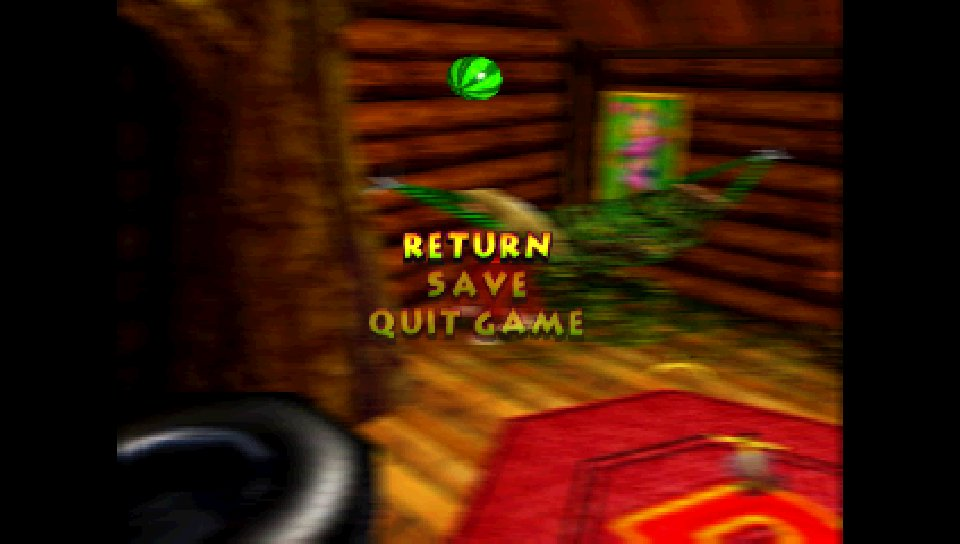

# Vita framebuffer readback validation

The RT64 Vita diagnostic can return correct GPU-rendered pixels through vitaGL in
Vita3K/Vulkan on Linux, but its first read of a surface still returns zero. With
Vulkan memory mapping disabled, every tested GPU read returns zero. This is a
correctness limitation, not a performance measurement or a readback fix.

## Controlled comparison, September 6, 2026

Both runs used the same diagnostic VPK, emulator executable, isolated filesystem,
firmware, shader compiler and Vulkan software device. Saved emulator configurations
differed only in `memory-mapping`. Neither run used the readback speedhack.

| Input | Value |
| --- | --- |
| Emulator | Vita3K v0.2.1 `4074-496939b6` |
| Full source revision | `496939b602703951277263c7b3e60a9ae36879c1` |
| Official Linux ARM64 artifact | [`vita3k-496939b6-linux-arm64`, artifact 9043818590](https://github.com/Vita3K/Vita3K/actions/runs/31333950952) |
| Artifact ZIP SHA-256 | `771616d91a33e4f25c0a504f0e66b69a5340020629d2413eb6418266edf5cb65` |
| Host | Ubuntu 24.04 ARM64 container, Xvfb |
| Renderer | Vulkan, llvmpipe (LLVM 20.1.2, 128 bits), Mesa 25.2.8 |
| Surface synchronization | Enabled in both runs (`disable-surface-sync: false`) |
| Mapping modes | `disabled`, `double-buffer`; each confirmed in the emulator log |
| vitaGL | `cd3791e29ff7f1c0ab349f12c7231f4871ce6a75` |
| vitaShaRK | `df24065e65098b2d1ac533760109ad4367573f28` |
| vitaGL options | `NO_SPLASHSCREEN=1`, `STORE_DEPTH_STENCIL=1`, `HAVE_PTHREAD=1`, `HAVE_GLSL_TEXTURE_SIZE=1`, `HAVE_SHADER_CACHE=1`, `READBACKS_SPEEDHACK=0` |
| Diagnostic CMake | Release; `DK64_VITA=ON`, `DK64_VITA_GAME=OFF`, `DK64_VITA_RUNTIME=OFF`, `RT64_FAST_READBACKS_SPEEDHACK=OFF` |
| Diagnostic VPK SHA-256 | `8d60e7f17956712c999ded6af493abcd740de9eeeeb29b024474a82f37354c2b` |
| Diagnostic eboot SHA-256 | `e5103bbc1d39310a00a9d610203a7a4b7b77548da8af1d00afa24515b46b1690` |

`DK64_VITA_RUNTIME=OFF` selects the diagnostic's explicit CPU-write notifications;
the new readback images contain only GPU draws and do not use that fallback.
The SDK archive's `glReadPixels` contains its scene reset and `sceGxmFinish` calls;
RT64 also retains its normal `glFinish` before reading.

| Check | Mapping disabled | Double-buffer mapping |
| --- | --- | --- |
| Direct 320x240 `glReadPixels`, frame 2 | 76,800 black pixels | 76,800 black pixels |
| Same image, frames 3, 4, 30 | 76,800 black pixels each | 75,915 non-black pixels each; all three files identical |
| First 64x64 GPU-only `readFramebuffer` | 4,096 zero RGBA16 values | 4,096 zero RGBA16 values |
| Three following alternating GPU images | 4,096 zero values each | All 4,096 values match the current image each time; zero match the previous image |
| Existing CPU-only scanout reads | Both match guest RAM | Both match guest RAM |

The 64x64 pattern alternates top/bottom red/blue (`f801`/`003f`) and green/yellow
(`07c1`/`ffc1`) in N64 RGBA16 format. This tests the public RT64 readback path,
top-to-bottom packing and freshness against known colors, rather than treating a
non-black image as sufficient. No CPU image uploads initialize these targets.

Each run was bounded to 20 seconds and ended with timeout exit 124 after reaching
both CPU-only scanout checks. The double-buffer emulator log also contains
`Unhandled SIGSEGV` messages while the diagnostic continues; this is not a clean
emulator-log or general stability result.

## Source explanation and limits

Source at the installed macOS app's reported revision explicitly disables memory
mapping on Apple platforms in
[`renderer.cpp`](https://github.com/Vita3K/Vita3K/blob/496939b602703951277263c7b3e60a9ae36879c1/vita3k/renderer/src/vulkan/renderer.cpp#L684).
[`perform_surface_sync`](https://github.com/Vita3K/Vita3K/blob/496939b602703951277263c7b3e60a9ae36879c1/vita3k/renderer/src/vulkan/surface_cache.cpp#L1197)
returns immediately when mapping is disabled. This agrees with the controlled
Linux result and explains why the macOS run cannot validate this synchronization
path. The source is matched to the reported revision, not a disassembly of the
installed macOS executable.

The first-read behavior is consistent with the same revision's lazy surface
tracking:
[`protect_surface`](https://github.com/Vita3K/Vita3K/blob/496939b602703951277263c7b3e60a9ae36879c1/vita3k/renderer/src/vulkan/surface_cache.cpp#L61)
marks a surface as needing synchronization when the CPU first accesses its memory.
The callback only sets flags; synchronization is performed during a later
[`context submission`](https://github.com/Vita3K/Vita3K/blob/496939b602703951277263c7b3e60a9ae36879c1/vita3k/renderer/src/vulkan/context.cpp#L451).
This is a source-based explanation of the observation, not an instrumented trace
of that callback. Repeating a static capture had concealed the distinction between
current and stale pixels; the alternating-image check makes it explicit.

These results do not prove a correct first pause snapshot, transition capture or
fairy photograph, and do not establish physical Vita behavior. They also do not
test the hardware build's requested delayed-readback option. No emulator-specific
retry, dummy draw or graphics workaround was added to the game or RT64.

## DK64 pause and resume

The same Linux emulator and double-buffer mapping were then used with the actual
ARM DK64 game probe, normal synchronized readbacks, and copied probe saves. The
scripted title `DK64RT001` uses a separate data directory. Its renderer records
only the bytes returned by the game's own framebuffer requests: it does not make
additional reads that might prime the surface tracking.

A first, 180-second run reached Training Grounds, paused, resumed and continued
moving. Its first captured image contained the earlier Nintendo boot logo; the
following transition and pause reads were black. Non-black pixels alone therefore
do not demonstrate a correct game screenshot.

The next probe added a second pause cycle. It entered DK's house from Training
Grounds, completed both pause/resume cycles in that room and continued moving.
The game requested the same 320x240 RGBA16 address, `0x00049800`, for both pauses:

| Game-requested capture | Colored pixels | Observed content |
| --- | --- | --- |
| Earlier read at `0x00034000` | 5,278 / 76,800 | Stale Nintendo boot logo |
| Earlier read at `0x0004fa00` | 0 / 76,800 | Black |
| First pause at `0x00049800` | 0 / 76,800 | Black |
| Second pause at `0x00049800` | 72,030 / 76,800 | Room image used for the blurred pause background |

Vita3K's own Vulkan screenshots independently show the visible result:

| First pause | Second pause |
| --- | --- |
|  |  |

The second resume screenshot shows Donkey Kong in the room with the sharp gameplay
image restored. Logs record both `pause=1` to `pause=0` transitions and subsequent
player movement. This verifies repeated pause rendering in that scene; it does not
establish first-read correctness, fairy photography, general transition behavior,
audio quality or physical Vita compatibility.

The repeat probe VPK SHA-256 is
`beeb1b5b3ce42047a851bbf9d4140f22936da113e977cd17016e1214b000c052`;
its eboot SHA-256 is
`90f48eeeb1ae4a46ee0571e9514082049e06ad59dcd2a4e41de974884f170185`.
All four raw captures are 153,600 bytes. The repeat run reached at least 3,480
graphics tasks before its 180-second bound (exit 124). Native screenshots were
requested with F12 in the isolated Xvfb game window; gameplay input came from the
probe callback. The screenshots do not use the failing guest readback path.

Raw captures, screenshots, configuration, input-save hashes and logs are retained
locally in `build/vita3k-linux-control/adventure-double-buffer-repeat-result/`, with
`validation.json` recording the results. The original probe saves and existing
quiet hardware VPK retain their hashes. Under the quiet build's compiler flags,
the renderer's preprocessed source is byte-identical before and after adding the
probe-only recording block. No hardware game build was regenerated or deployed.

## Repeating the diagnostic

Build `rt64_fast_smoke.vpk-vpk` using the normal readback options above and the
[Vita build instructions](VITA.md#renderer-validation-build). Run title `RT64F3001`
in an isolated Vita3K profile with the supplied shader compiler and installed
firmware. Keep Vulkan selected, including any per-title override. Save
`ux0/data/rt64-fast/` and the emulator log after each run before selecting the other
mapping mode.

The diagnostic writes `frame.ppm` for frame 2, `frame-3.ppm`, `frame-4.ppm`,
`frame-30.ppm`, and four `gpu-readback-N.rgba16` files. The latter are 8,192-byte,
top-to-bottom, big-endian 64x64 images. `progress.log` records exact current,
previous and zero pixel counts; a mismatch is recorded so the remaining cases can
still run. It must not be interpreted as passing because the program keeps running.

For an extracted Linux AppImage, set `APPIMAGE` to the original AppImage pathname
and `APPDIR` to its extracted root before invoking `AppRun`. This revision's
portable mode looks for built-in assets beside `usr/bin/Vita3K`, bypassing the
normal AppImage asset-path selection. In the isolated extraction, symlink the
bundled `usr/share/Vita3K` asset directories beside the executable. Put the profile
in `portable/` beside the AppImage; its default configuration must identify the
installed title before command-line title validation runs. These are test-profile
layout adjustments, not modifications to the emulator executable.

Local evidence for this run is under `build/vita3k-linux-control/`: the two
`*-alternating-result/` directories contain the raw images, logs and configurations;
`validation.json` records their hashes and independently counted pixel results.
The images, firmware and emulator binaries are excluded from Git. The physical
Vita's installed game, staged quiet VPK and game data were not modified by this
diagnostic work.
